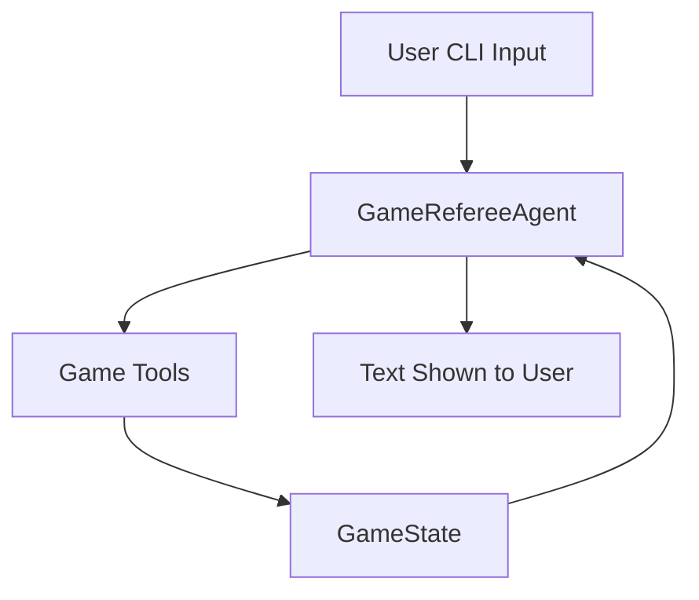
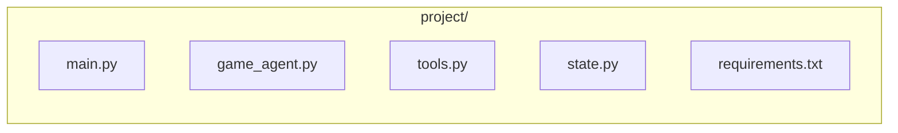
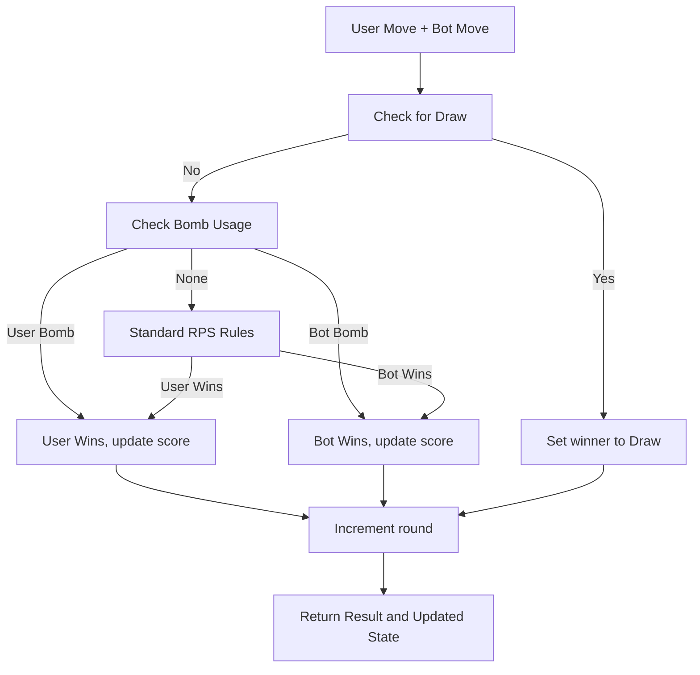

#  Rock–Paper–Scissors–Plus: AI Game Referee Documentation

This project implements a robust, testable, and maintainable AI-powered referee for Rock–Paper–Scissors–Plus using Python and Google ADK (Agent Development Kit). The solution follows strict agent-based design, with clean delineation between game state, logic, and interface.

---

## What is Google ADK?

Google ADK (Agent Development Kit) is a framework for building agent-based systems.  
It provides abstractions for agents and tools, enabling clear separation between
orchestration, business logic, and state management. In this project, ADK is used
to structure the game referee as an agent and delegate validation and game logic to tools.

## 🏗️ High-Level System Architecture

The system processes user input in a CLI loop, delegates logic and validation to ADK tools, and keeps state externally for each round. The flow is as follows:


*Illustrates the separation and flow from user input to final user response.*

---

## 📂 Project Structure


*Shows the file organization*

---
**File responsibilities:**
- `main.py` – CLI orchestration and game loop
- `game_agent.py` – Google ADK-based referee agent
- `tools.py` – Game logic and validation tools
- `state.py` – Game state data model
- `requirements.txt` – Project dependencies


---
# requirements.txt

This file lists the Python dependencies required to run the project.

```txt
google-adk 
```

- **Purpose**: Ensures you have Google ADK available, which provides the agent framework.
- **Usage**: Install dependencies with:

    ```bash
    pip install -r requirements.txt
    ```

---

# state.py

This file defines the immutable core of the game: its **state**.

```python
from dataclasses import dataclass

@dataclass
class GameState:
    round_number: int = 1
    user_score: int = 0
    bot_score: int = 0
    user_bomb_used: bool = False
    bot_bomb_used: bool = False
    max_rounds: int = 3
```

### Description

- **GameState** is a dataclass tracking:
    - `round_number`: Current round (starts at 1).
    - `user_score`: User's current score.
    - `bot_score`: Bot's current score.
    - `user_bomb_used`: Has the user used their bomb? (True/False)
    - `bot_bomb_used`: Has the bot used its bomb? (True/False)
    - `max_rounds`: Total rounds for the match (fixed at 3).

### Rationale

- State is **explicitly managed outside the prompts** and passed between components, supporting best practices for agent design.

---

# tools.py

This file contains **pure Python tools** for the agent: move validation and round resolution.

```python
import random

VALID_MOVES = {"rock", "paper", "scissors", "bomb"}
COMMON_MISTAKES = {
    "scissor": "scissors",
    "papers": "paper",
    "rocks": "rock"
}

def validate_move(move: str, bomb_used: bool) -> dict:
    """Validate user move and bomb usage."""
    if not move:
        return {"valid": False, "reason": "No move provided. Round wasted."}
    move = move.lower().strip()
    # Fix common spelling mistakes (safe normalization)
    if move in COMMON_MISTAKES:
        move = COMMON_MISTAKES[move]
    if move not in VALID_MOVES:
        return {"valid": False, "reason": "Invalid move. Round wasted."}
    if move == "bomb" and bomb_used:
        return {"valid": False, "reason": "Bomb already used. Round wasted."}
    return {"valid": True, "move": move}

def resolve_round(user_move: str, state) -> dict:
    """Resolve one round and mutate game state."""
    bot_moves = ["rock", "paper", "scissors"]
    if not state.bot_bomb_used:
        bot_moves.append("bomb")
    bot_move = random.choice(bot_moves)
    # Track bomb usage
    if user_move == "bomb":
        state.user_bomb_used = True
    if bot_move == "bomb":
        state.bot_bomb_used = True
    winner = "draw"
    if user_move == bot_move:
        pass
    elif user_move == "bomb":
        winner = "user"
        state.user_score += 1
    elif bot_move == "bomb":
        winner = "bot"
        state.bot_score += 1
    elif (
        (user_move == "rock" and bot_move == "scissors") or
        (user_move == "scissors" and bot_move == "paper") or
        (user_move == "paper" and bot_move == "rock")
    ):
        winner = "user"
        state.user_score += 1
    else:
        winner = "bot"
        state.bot_score += 1
    state.round_number += 1
    return {
        "bot_move": bot_move,
        "winner": winner
    }
```

### Functions

- **validate_move(move, bomb_used)**:
    - Normalizes and validates the user's move.
    - Catches known typos (e.g., "scissor" → "scissors").
    - Checks bomb usage rules.
    - Returns a dict with validation result and error message if invalid.

- **resolve_round(user_move, state)**:
    - Randomly selects the bot's move (respects bomb usage).
    - Compares moves, determines round winner, updates scores and usage flags.
    - Advances the round number.
    - Returns bot's move and round winner.

### Input Normalization

- Only handles a few **hardcoded common spelling mistakes**.
- Invalid or unexpected input results in the round being wasted, as per the rules.

### Round Evaluation Flow



---

# game_agent.py

This file implements the **ADK-powered GameRefereeAgent**, which organizes the game flow and delegates logic to tools.

```python
from google.adk.agents import Agent
from state import GameState
from tools import validate_move, resolve_round

class GameRefereeAgent:
    """ Wrapper class around ADK Agent to manage game flow. """

    def __init__(self):
        # Actual ADK Agent (this is what evaluators want to see)
        self.agent = Agent(
            name="rps_plus_referee",
            tools=[validate_move, resolve_round],
            instruction=(
                "You are a referee for a Rock–Paper–Scissors–Plus game. "
                "Enforce rules, track rounds and scores, and explain outcomes clearly."
            ),
        )

    def explain_rules(self) -> str:
        return (
            "Rock–Paper–Scissors–Plus rules:\n"
            "• Best of 3 rounds\n"
            "• Moves: rock, paper, scissors, bomb\n"
            "• Bomb beats all but usable once\n"
            "• Invalid input wastes the round"
        )

    def process_turn(self, user_input: str, state: GameState):
        """ Process a single turn using ADK tools. """
        current_round = state.round_number

        # --- ADK TOOL: validate_move ---
        validation = validate_move(user_input, state.user_bomb_used)
        # Invalid input → round wasted
        if not validation["valid"]:
            state.round_number += 1
            response = (
                f"Round {current_round}\n"
                f"{validation['reason']}\n"
                f"Score → You: {state.user_score}, Bot: {state.bot_score}"
            )
            return response, state

        # --- ADK TOOL: resolve_round ---
        result = resolve_round(validation["move"], state)
        response = (
            f"Round {current_round}\n"
            f"You played: {validation['move']}\n"
            f"Bot played: {result['bot_move']}\n"
            f"Round winner: {result['winner']}\n"
            f"Score → You: {state.user_score}, Bot: {state.bot_score}"
        )
        return response, state
```

### Key Responsibilities

- **Agent Initialization**: Sets up an ADK Agent named `"rps_plus_referee"`, registering the validation and resolution tools.
- **Rule Explanation**: Offers a human-readable summary of the game rules.
- **Turn Processing**:
    - Calls `validate_move` to ensure the move is legal.
    - If invalid, skips to the next round and informs the user.
    - If valid, calls `resolve_round` to determine the winner, update state, and construct a response.

### Design Principles

- **Separation of Concerns**: The agent does not implement the game logic; it delegates to tools.
- **State Passing**: Agents and tools work with explicit state, never hidden or prompt-based memory.

---

# main.py

This file implements the **game orchestration and CLI loop**.

```python
from state import GameState
from game_agent import GameRefereeAgent

def main():
    agent = GameRefereeAgent()
    state = GameState()

    print("\n=== Welcome to Rock–Paper–Scissors–Plus ===\n")
    print(agent.explain_rules())

    # Game loop (max 3 rounds)
    while state.round_number <= state.max_rounds:
        user_input = input("\nEnter your move: ")
        response, state = agent.process_turn(user_input, state)
        print(response)

    # Game over
    print("\n=== GAME OVER ===")
    if state.user_score > state.bot_score:
        print("Final Result: You win!")
    elif state.bot_score > state.user_score:
        print("Final Result: Bot wins!")
    else:
        print("Final Result: It's a draw!")

if __name__ == "__main__":
    main()
```

### Responsibilities

- **Game Startup**: Welcomes the user and displays the rules.
- **Game Loop**: Prompts the user, processes turns, displays round results.
- **Endgame**: Declares the final winner after 3 rounds.
- **No External State**: State is passed between calls, not hidden in prompts or globals.

---

# 🗂️ Summary Table

| File             | Purpose                                | Key Classes/Functions            |
|------------------|----------------------------------------|----------------------------------|
| `requirements.txt` | Lists dependencies                    | `google-adk`                    |
| `state.py`         | Manages game state                    | `GameState`                      |
| `tools.py`         | Game logic and validation             | `validate_move`, `resolve_round` |
| `game_agent.py`    | Orchestrates game using ADK           | `GameRefereeAgent`               |
| `main.py`          | CLI loop and game orchestration       | `main()`                         |

---

# 🚦 Example CLI Flow

```
=== Welcome to Rock–Paper–Scissors–Plus ===

Rock–Paper–Scissors–Plus rules:
• Best of 3 rounds
• Moves: rock, paper, scissors, bomb
• Bomb beats all but usable once
• Invalid input wastes the round

Enter your move: rock
Round 1
You played: rock
Bot played: scissors
Round winner: user
Score → You: 1, Bot: 0

... (2 more rounds)

=== GAME OVER ===
Final Result: You win!
```

---


# 🏁 How to Run

1. **Install Requirements**

    ```bash
    pip install -r requirements.txt
    ```

2. **Start Game**

    ```bash
    python main.py
    ```

---

**Enjoy challenging the bot referee in Rock–Paper–Scissors–Plus!**